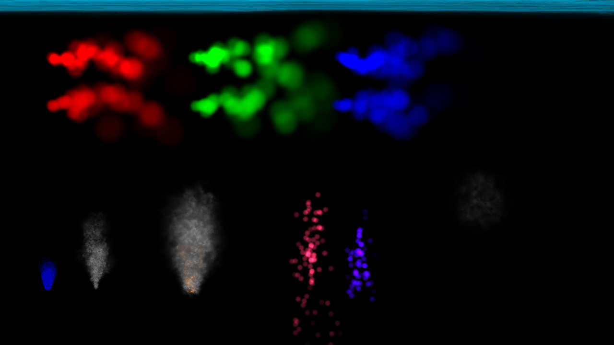

# DR-particles

Small library and example code to create particle emitters in DragonRuby

### Demo



The emitters used to create the effects above can be found in [example_emitters.rb](app/example_emitters.rb)

## Installation

Preferred install is via DragonRuby builtin [download_stb_rb](http://docs.dragonruby.org.s3-website-us-east-1.amazonaws.com/docs.html#-----download_stb_rb(_raw)-)

First, download the lib using the above method, in the DragonRuby Console:

```
$gtk.download_stb_rb "https://github.com/owenbutler/DR-particles/blob/main/app/particles.rb"
```

By default, this will download the lib to `owenbutler/DR-particles/particles.rb`

Include the following in your `main.rb`:

```
require 'owenbutler/DR-particles/particles.rb'
```

For more control over where the lib is downloaded, see the docs for [download_stb_rb](http://docs.dragonruby.org.s3-website-us-east-1.amazonaws.com/docs.html#-----download_stb_rb(_raw)-)

## Usage

Minimal example:

```ruby
require 'owenbutler/DR-particles/particles.rb'

$particles = []
$emitters = [
  {
    num: 6, freq: 1,
    x: 650, y: 120, w: 16, h: 16,
    grow_factor: 1.002,
    path: 'sprites/circle/white.png',
    xv_min: -5.7, xv_max: 5.7,
    yv_min: 8, yv_max: 15.0,
    grav: true, grav_x: 0.0, grav_y: -0.201,
    time: 100,
    r: 255, g: 50, b: 70,
    a: 255, blendmode_enum: 2,
    fade: true, fade_start: 255, fade_end: 0, fade_ease: :quad,
  },
]

def tick args

  args.outputs.background_color = [0, 0, 0]

  particles_tick($emitters, $particles, args)
end

```

## TODO

- Add support for procedual palettes, ala https://owenbutler.itch.io/palette-test